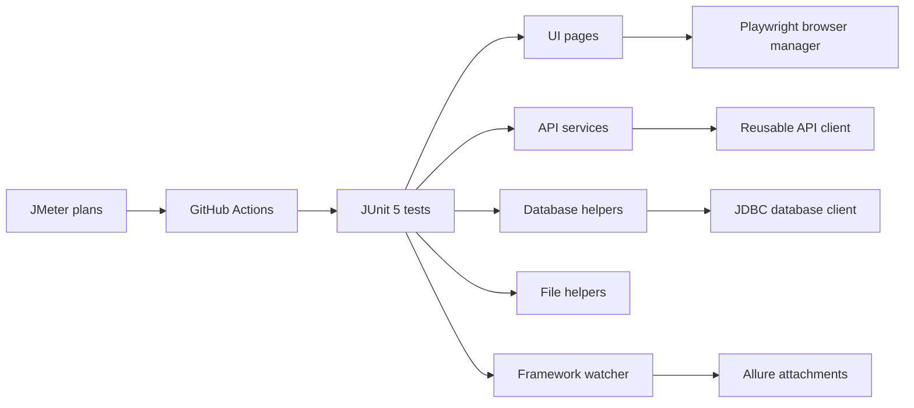

# Automation Framework Portfolio Project

[](https://github.com/DenTerrens/automation_framework_demo/actions/workflows/ui-smoke.yml)
[](https://github.com/DenTerrens/automation_framework_demo/actions/workflows/ci.yml)
[](https://github.com/DenTerrens/automation_framework_demo/actions/workflows/performance.yml)
[](https://github.com/DenTerrens/automation_framework_demo/actions/workflows/pages-allure-report.yml)

A showcase-quality Java automation framework that demonstrates how a Senior SDET would design UI, API, database, file, reporting, and CI/CD automation as one cohesive system. The repo is built to be explainable in interviews, credible in client demos, and useful as a real starting point for a production test framework.

## What this framework covers

- UI automation with Playwright Java, stable selectors, page objects, screenshots, DOM capture, and failure video attachment
- API automation with RestAssured covering GET, POST, PUT, PATCH, and DELETE flows
- Auth-ready API design with `none`, `basic`, and `bearer` support
- SQL verification with reusable JDBC helpers and cross-layer state checks
- File verification for text, CSV, TSV, JSON, XML, and generated outputs
- End-to-end integrated tests using a local demo app that supports create, update, delete, and file-upload workflows
- Allure reporting with human-readable evidence
- GitHub Actions smoke, regression, performance, and Pages publishing workflows
- Maven-based build, formatting checks, environment-driven configuration, and reusable test-data factories

## Why this stack

- `Maven`: predictable Java dependency management, strong CI compatibility, and familiar enterprise conventions
- `JUnit 5`: modern tagging, parallel execution, and extension support without legacy runner overhead
- `Playwright Java`: strong selector model, built-in stability, and first-class browser artifact capture
- `RestAssured`: readable API tests with straightforward request/response assertions and schema support
- `JDBC + SQL`: transparent, low-abstraction database verification that is easy to explain and debug
- `Allure`: polished local and CI reporting with meaningful attachments
- `GitHub Actions`: clear workflow visibility for recruiters, hiring managers, and clients reviewing the project

## Feature matrix

| Capability | Implementation |
| --- | --- |
| UI automation | Playwright Java + JUnit 5 |
| UI abstraction | Page objects with stable `data-test` selectors |
| UI evidence | Full-page screenshot, DOM snapshot, failure text, failure video |
| API automation | RestAssured client + service layer |
| API coverage | GET, POST, PUT, PATCH, DELETE, schema, negative, idempotency |
| Database verification | JDBC helpers + H2-backed demo data |
| Cross-layer tests | UI -> API -> DB and API -> UI -> DB |
| File verification | Commons CSV + Jackson + XML DOM |
| Performance | JMeter smoke plan with scheduled CI execution |
| Reporting | Allure + Surefire + log file artifacts |
| Quality gates | Spotless formatting + smoke/regression workflows |

## Architecture overview



## Real test coverage in this repo

### UI automation

- External smoke coverage against SauceDemo for login success and login failure
- Local integrated demo app for admin login, CRUD user management, and file upload
- Stable `data-test` selectors in the local demo UI
- Reusable page objects in [src/main/java/com/automation/framework/ui/pages](/C:/Projects/automation_framework/src/main/java/com/automation/framework/ui/pages)

### API automation

- Public API examples in [UsersApiTest.java](/C:/Projects/automation_framework/src/test/java/com/automation/framework/tests/api/UsersApiTest.java)
- Integrated local API CRUD coverage in [DemoApiCrudVerificationTest.java](/C:/Projects/automation_framework/src/test/java/com/automation/framework/tests/demo/DemoApiCrudVerificationTest.java)
- Auth flow via [AuthApi.java](/C:/Projects/automation_framework/src/main/java/com/automation/framework/api/service/AuthApi.java)
- File-processing lookup via [UploadsApi.java](/C:/Projects/automation_framework/src/main/java/com/automation/framework/api/service/UploadsApi.java)

### SQL and cross-layer verification

- Reusable DB access in [DatabaseClient.java](/C:/Projects/automation_framework/src/main/java/com/automation/framework/db/DatabaseClient.java)
- Data integrity checks in [DatabaseVerificationTest.java](/C:/Projects/automation_framework/src/test/java/com/automation/framework/tests/db/DatabaseVerificationTest.java)
- Cross-system verification in [DemoCrossLayerVerificationTest.java](/C:/Projects/automation_framework/src/test/java/com/automation/framework/tests/demo/DemoCrossLayerVerificationTest.java)

The integrated demo tests prove:
- create in UI -> verify in API and DB
- update via API -> verify in UI and DB
- upload file in UI -> verify processing via API and DB

## Project structure

- `src/main/java/com/automation/framework/config`: config and environment resolution
- `src/main/java/com/automation/framework/ui`: Playwright lifecycle and page objects
- `src/main/java/com/automation/framework/api`: reusable API client and domain services
- `src/main/java/com/automation/framework/db`: JDBC helpers
- `src/main/java/com/automation/framework/files`: file parsers and assertions
- `src/main/java/com/automation/framework/reporting`: Allure attachment helpers
- `src/main/java/com/automation/framework/utils`: shared utilities such as polling/retry support
- `src/test/java/com/automation/framework/demoapp`: embedded local demo system used by integrated tests
- `src/test/java/com/automation/framework/tests`: smoke, regression, DB, file, integration, and failure-demo tests
- `src/test/resources/config`: base and environment-specific properties
- `src/test/resources/data`: payloads, schemas, and file fixtures
- `src/test/resources/db`: schema and seed scripts
- `performance/jmeter/plans`: JMeter assets

## Local setup

Prerequisites:

- Java 17+
- Maven 3.9+
- Playwright browser install support on first run
- Optional: Allure CLI for local HTML viewing
- Optional: JMeter for local performance execution

Optional local env template:

- Copy values from [.env.example](/C:/Projects/automation_framework/.env.example) into your shell, IDE run configuration, or CI secrets

## How to run locally

Run the full regression set:

```bash
mvn clean test
```

Run only smoke coverage:

```bash
mvn clean test -Dgroups=smoke
```

Run only API tests:

```bash
mvn clean test -Papi
```

Run only DB verification:

```bash
mvn clean test -Pdb
```

Run only file verification:

```bash
mvn clean test -Pfiles
```

Run only the local integrated demo flows:

```bash
mvn clean test -Dgroups=demo
```

Switch environment or browser:

```bash
mvn clean test -Denv=qa -Dbrowser=firefox -Dheadless=false
```

## Reporting

Test outputs are written to:

- `allure-results`: raw Allure results and attachments
- `allure-report`: persistent HTML report
- `reports/surefire`: Surefire XML/TXT outputs
- `logs/automation-framework.log`: framework log file

Generate the local Allure report:

```bash
mvn clean test
mvn allure:report
mvn allure:serve
```

For UI failures, the framework attaches:

- full-page screenshot
- DOM snapshot
- failure reason text
- Playwright video when available

Intentional failure demos are opt-in so normal runs stay green:

```bash
mvn clean test -Pfailure-demo
```

## CI/CD

The repository includes four GitHub Actions workflows:

- `smoke-suite`: runs on push, pull request, and manual dispatch; executes `-Dgroups=smoke`
- `regression-suite`: runs on push and pull request; executes `-Dgroups=regression`
- `performance`: runs weekly and manually; executes the JMeter smoke plan and publishes a summary
- `pages-allure-report`: builds and deploys the Allure HTML report to GitHub Pages when meaningful framework files change

CI artifacts include:

- Allure raw results
- Surefire reports
- framework logs
- JMeter `.jtl` and HTML report for performance runs

Secrets strategy:

- GitHub Actions maps repository secrets to Maven `-D` properties for API auth
- the same names are documented in [.env.example](/C:/Projects/automation_framework/.env.example)

## GitHub Pages report

Set `Settings -> Pages -> Source` to `GitHub Actions`.

The Pages workflow publishes the generated Allure HTML report to:

- [GitHub Pages report](https://denterrens.github.io/automation_framework_demo/)

## Engineering touches

- Spotless formatting check via `mvn spotless:check`
- Source formatting via `mvn spotless:apply`
- `.editorconfig` for consistent editor behavior
- config-driven execution through `ConfigManager`
- reusable data factory in [DemoUserDataFactory.java](/C:/Projects/automation_framework/src/test/java/com/automation/framework/tests/demo/DemoUserDataFactory.java)
- reusable API and DB helpers
- polling-based retry support for eventual-consistency checks in [RetrySupport.java](/C:/Projects/automation_framework/src/main/java/com/automation/framework/utils/RetrySupport.java)

## Limitations

- The repo still uses public demo systems for some smoke/API examples, so those tests are less controllable than internal environments
- The integrated demo app is intentionally lightweight and embedded for portability; a production framework would usually target real deployed systems
- H2 is excellent for demoability, but production SQL differences would need engine-specific coverage
- The performance suite is a smoke-level illustration, not a true load model

## Next improvements

- Add OpenAPI-driven contract checks for the local demo API
- Add Docker-based ephemeral dependencies for stronger environment realism
- Publish richer report screenshots and architecture visuals under `docs/assets`
- Expand negative-path coverage for auth and file-processing failures

## Documentation index

- [Architecture](docs/ARCHITECTURE.md)
- [Running Tests](docs/RUNNING_TESTS.md)
- [Contributing Guide](docs/CONTRIBUTING.md)
- [Troubleshooting](docs/TROUBLESHOOTING.md)
