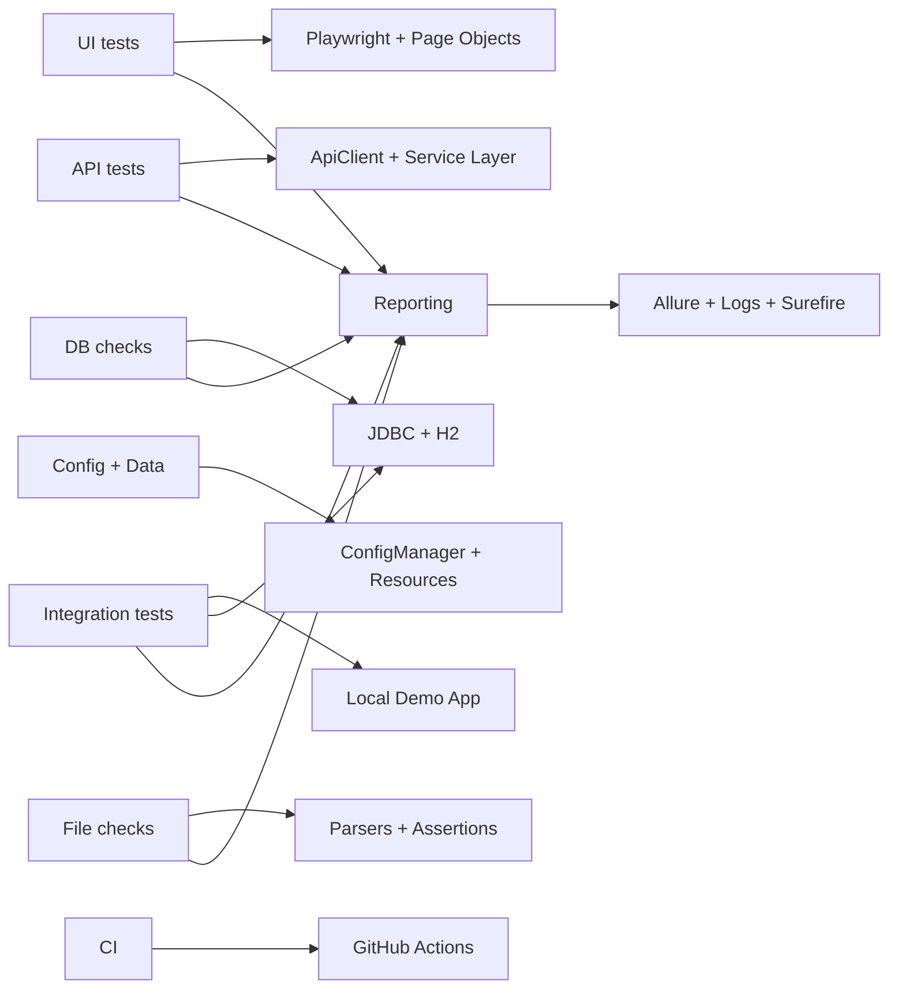
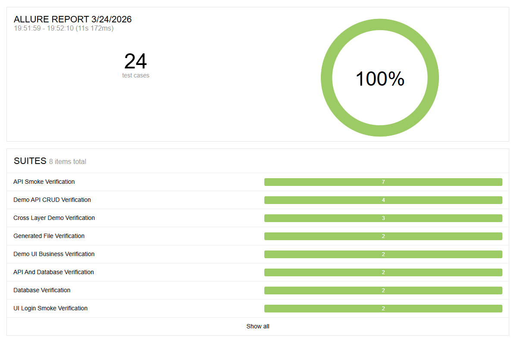
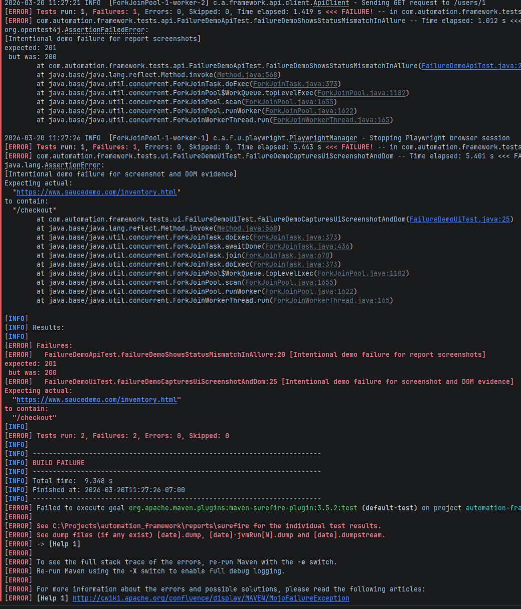
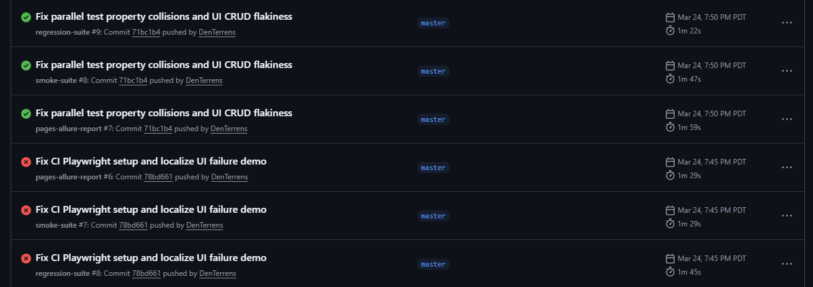
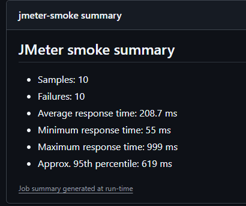

# Enterprise Test Framework

[](https://github.com/DenTerrens/automation_framework_demo/actions/workflows/ui-smoke.yml)
[](https://github.com/DenTerrens/automation_framework_demo/actions/workflows/ci.yml)
[](https://github.com/DenTerrens/automation_framework_demo/actions/workflows/performance.yml)
[](https://github.com/DenTerrens/automation_framework_demo/actions/workflows/pages-allure-report.yml)

This is a Java/Maven SDET demo framework that covers UI, API, database, file, and end-to-end integrated verification. It uses Playwright Java for UI, Rest Assured for API, JDBC/H2 for database checks, Allure for reporting, and GitHub Actions for CI. I also included a small local demo system so cross-layer flows can run deterministically instead of depending only on public demo sites.

## Quick Run (2 minutes)

```bash
git clone https://github.com/DenTerrens/automation_framework_demo.git
cd automation_framework_demo
mvn clean test
```

Runs smoke + integration tests locally with embedded demo app.

## Impact

This framework demonstrates how to reduce reliance on manual testing,
improve release confidence, and provide clear evidence for test results
across UI, API, and backend layers.

## What this framework covers

- UI automation with Playwright Java, page objects, stable selectors, screenshots, DOM capture, and video on failure
- API automation with GET, POST, PUT, PATCH, and DELETE coverage
- Database verification with JDBC and seeded H2 data
- File verification for text, CSV, TSV, JSON, and XML
- Cross-layer flows that verify state across UI, API, and DB
- Smoke vs regression targeting through JUnit 5 tags
- Allure reporting, logs, Surefire output, and CI artifacts
- GitHub Actions workflows for smoke, regression, performance, and Pages publishing

## Why this repo exists

I built this repo to show real SDET design decisions, not just isolated test scripts. The goal is to demonstrate:

- multi-layer automation in one framework
- deterministic integrated verification
- clean separation of concerns
- practical CI execution and reporting
- realistic handling of flakiness and shared-state issues

## Test Layering Approach

UI tests are limited to critical user workflows.
API and DB checks are used for deeper validation and faster feedback.
Integration tests combine layers where end-to-end behavior matters.
This reduces test flakiness and keeps execution time practical.

## Test Stability

Targeted retries and polling are used only where async behavior is expected.
Shared resources are protected to avoid parallel test conflicts.
The local demo app ensures deterministic test execution.

## Tech stack

- Java 17
- Maven
- JUnit 5
- Playwright Java
- Rest Assured
- JDBC + H2
- Allure
- GitHub Actions
- JMeter
- Spotless

## Architecture at a glance



## Test layers

### UI

- [UiLoginSmokeTest.java](src/test/java/com/automation/framework/tests/ui/UiLoginSmokeTest.java)
  - tags: `ui`, `smoke`, `regression`
  - target: local demo app
  - covers login success and login failure

- [DemoUiBusinessFlowTest.java](src/test/java/com/automation/framework/tests/demo/DemoUiBusinessFlowTest.java)
  - tags: `ui`, `demo`, `regression`
  - target: local demo app
  - covers login, create, update, and delete user flows

### API

- [UsersApiTest.java](src/test/java/com/automation/framework/tests/api/UsersApiTest.java)
  - tags: `api`, `smoke`, `regression`
  - target: public demo API examples
  - covers CRUD-style examples, schema checks, negative case, and idempotency

- [DemoApiCrudVerificationTest.java](src/test/java/com/automation/framework/tests/demo/DemoApiCrudVerificationTest.java)
  - tags: `api`, `demo`, `regression`
  - target: local deterministic API
  - covers authenticated CRUD, PATCH, schema, negative case, and repeated GET

### Database

- [DatabaseVerificationTest.java](src/test/java/com/automation/framework/tests/db/DatabaseVerificationTest.java)
  - tags: `db`, `regression`
  - target: seeded H2 verification DB
  - covers seeded data checks and integrity checks

### Files

- [GeneratedFileVerificationTest.java](src/test/java/com/automation/framework/tests/files/GeneratedFileVerificationTest.java)
  - tags: `files`, `regression`
  - target: generated-style resource fixtures
  - covers text, CSV, TSV, JSON, and XML checks

### Integration

- [ApiDatabaseVerificationTest.java](src/test/java/com/automation/framework/tests/integration/ApiDatabaseVerificationTest.java)
  - tags: `integration`, `regression`
  - target: public API + local DB audit persistence
  - covers API-to-DB alignment

- [DemoCrossLayerVerificationTest.java](src/test/java/com/automation/framework/tests/demo/DemoCrossLayerVerificationTest.java)
  - tags: `integration`, `demo`, `regression`
  - target: local demo app + local DB
  - covers:
    - create in UI -> verify in API and DB
    - update via API -> verify in UI and DB
    - upload in UI -> verify API output and DB audit record
    - invalid UI submission -> verify no DB record is created

### Failure demos

- [FailureDemoUiTest.java](src/test/java/com/automation/framework/tests/ui/FailureDemoUiTest.java)
- [FailureDemoApiTest.java](src/test/java/com/automation/framework/tests/api/FailureDemoApiTest.java)

These are excluded by default and exist only to show how failed runs look in Allure.

## Local demo system

The local demo system is the main proof point in this repo. It lives in:

- [DemoAppServer.java](src/test/java/com/automation/framework/demoapp/DemoAppServer.java)
- [DemoAppSupport.java](src/test/java/com/automation/framework/demoapp/DemoAppSupport.java)

It provides:

- login flow
- user CRUD flow
- file upload processing flow
- API endpoints for users and uploads
- DB-backed state that can be verified after UI and API actions

I use public demo API tests to show portability, but I use the embedded app as the primary proof for deterministic integrated verification.

## What this proves

This repo demonstrates:

- UI, API, database, and file validation in one framework
- cross-layer verification instead of isolated test scripts
- config-driven execution and suite targeting
- CI execution with smoke and regression separation
- centralized evidence capture for failures
- practical handling of flakiness and shared-state issues

## How to run smoke

```bash
mvn clean test -Dgroups=smoke
```

## How to run regression

```bash
mvn clean test
```

## How to run only UI / API / DB / files / integration

```bash
mvn clean test -Pui
mvn clean test -Papi
mvn clean test -Pdb
mvn clean test -Pfiles
mvn clean test -Pintegration
```

You can also run the local integrated demo flows directly:

```bash
mvn clean test -Dgroups=demo
```

## How reporting works

The framework writes:

- raw Allure results to `allure-results`
- persistent Allure HTML to `allure-report`
- Surefire outputs to `reports/surefire`
- framework logs to `logs/automation-framework.log`

For UI failures, I attach:

- full-page screenshot
- DOM snapshot
- failure reason text
- Playwright video when available

Generate the local report with:

```bash
mvn clean test
mvn allure:report
mvn allure:serve
```

## How CI works

I use four workflows:

- `smoke-suite`
  - push, pull request, manual
  - runs `-Dgroups=smoke`

- `regression-suite`
  - push and pull request
  - runs `-Dgroups=regression`

- `performance`
  - weekly and manual
  - runs the JMeter smoke plan and publishes artifacts plus a summary

- `pages-allure-report`
  - manual and meaningful framework changes
  - generates and publishes the Allure HTML report to GitHub Pages

CI uploads:

- Allure results
- Surefire reports
- framework logs
- JMeter report artifacts

## Why I made these design choices

- JUnit 5 for tags, extensions, and parallel execution
- Playwright Java for browser automation with modern stability and evidence capture
- Rest Assured behind service abstractions to keep tests readable
- JDBC/H2 to keep database verification explicit and portable
- Embedded local demo app to support deterministic integrated testing
- Targeted retry/polling only where async behavior is realistic
- Resource locking for shared JVM state when tests run in parallel

## How to review this repo quickly

If you only review five things, start here:

1. [DemoCrossLayerVerificationTest.java](src/test/java/com/automation/framework/tests/demo/DemoCrossLayerVerificationTest.java)
2. [DemoAppServer.java](src/test/java/com/automation/framework/demoapp/DemoAppServer.java)
3. [ApiClient.java](src/main/java/com/automation/framework/api/client/ApiClient.java) and [UsersApi.java](src/main/java/com/automation/framework/api/service/UsersApi.java)
4. [PlaywrightManager.java](src/main/java/com/automation/framework/ui/playwright/PlaywrightManager.java)
5. [.github/workflows/ci.yml](.github/workflows/ci.yml)

## Example outputs

### Allure overview



### Failed UI evidence



### GitHub Actions run



### JMeter summary



## Known tradeoffs

- H2 is used for portability and fast demo setup, not to replicate production-specific DB behavior
- Some API tests use public demo services for simple examples
- The embedded app is intentionally small and deterministic rather than a full enterprise environment

## Project structure

- `src/main/java/com/automation/framework/ui` - Playwright and page objects
- `src/main/java/com/automation/framework/api` - API client and service layers
- `src/main/java/com/automation/framework/db` - DB access helpers
- `src/main/java/com/automation/framework/files` - file parsing and assertions
- `src/test/java/com/automation/framework/tests` - suites and base classes
- `src/test/java/com/automation/framework/demoapp` - deterministic embedded demo app
- `.github/workflows` - CI/CD pipelines
- `performance/jmeter` - JMeter sample plan and outputs

## Additional docs

- [Architecture](docs/ARCHITECTURE.md)
- [Running Tests](docs/RUNNING_TESTS.md)
- [Contributing Guide](docs/CONTRIBUTING.md)
- [Troubleshooting](docs/TROUBLESHOOTING.md)
